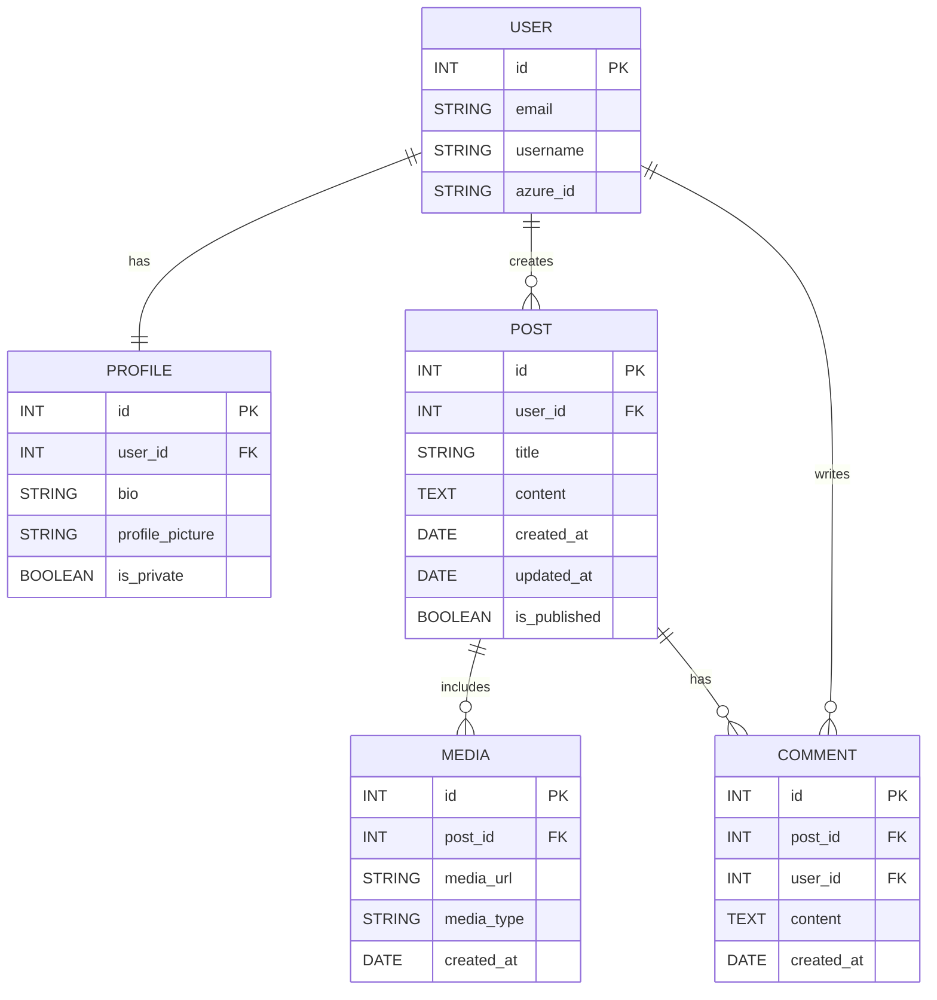

# Database design

## Relationship diagram

```mermaid
erDiagram
    USER {
        INT id PK
        STRING email
        STRING username
        STRING azure_id
    }

    PROFILE {
        INT id PK
        INT user_id FK
        STRING bio
        STRING profile_picture
        BOOLEAN is_private
    }

    POST {
        INT id PK
        INT user_id FK
        STRING title
        TEXT content
        DATE created_at
        DATE updated_at
        BOOLEAN is_published
    }

    MEDIA {
        INT id PK
        INT post_id FK
        STRING media_url
        STRING media_type
        DATE created_at
    }

    COMMENT {
        INT id PK
        INT post_id FK
        INT user_id FK
        TEXT content
        DATE created_at
    }

    USER ||--|| PROFILE : "has"
    USER ||--o{ POST : "creates"
    POST ||--o{ MEDIA : "includes"
    POST ||--o{ COMMENT : "has"
    USER ||--o{ COMMENT : "writes"
```
